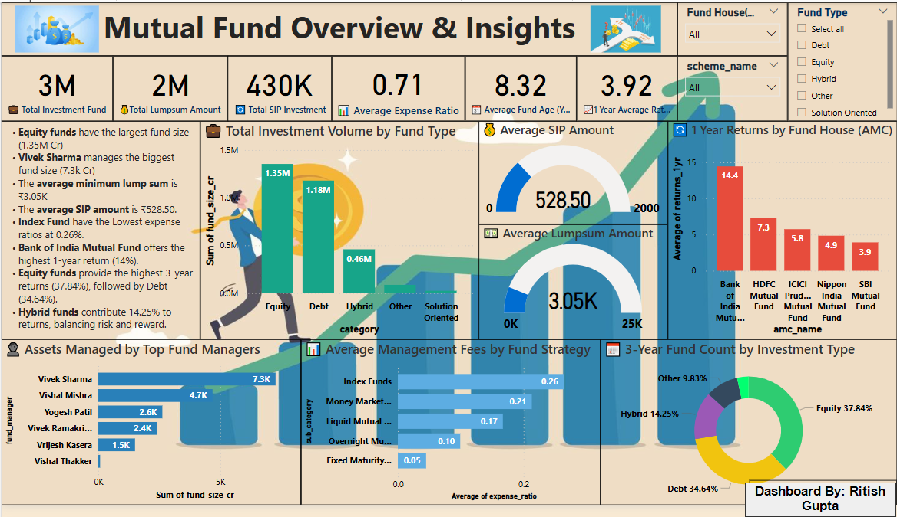

# Mutual Fund Analysis Dashboard

This project presents a Mutual Fund Analysis using Python, Power BI, and Jupyter Notebook.

## 🔗 Project Files:
- [Jupyter Notebook](./Mutual%20Fund%20Analysis.ipynb)
- [Power BI File](./Mutual%20Fund%20Dashboard.pbix)
- [Dashboard Image](./Mutual_Fund_Dashboard.png)
- [Main Dataset](./Mutual_Funds.csv)
- [Top 30 Filtered Funds](./top_30_mutual_funds.xlsx)

## 📈 Keywords:
`Mutual Fund`, `Python`, `Power BI`, `Investment Dashboard`, `Data Analysis`, `Portfolio Insights`
